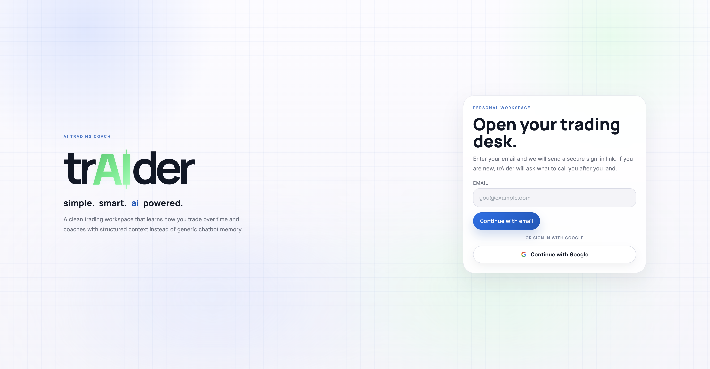
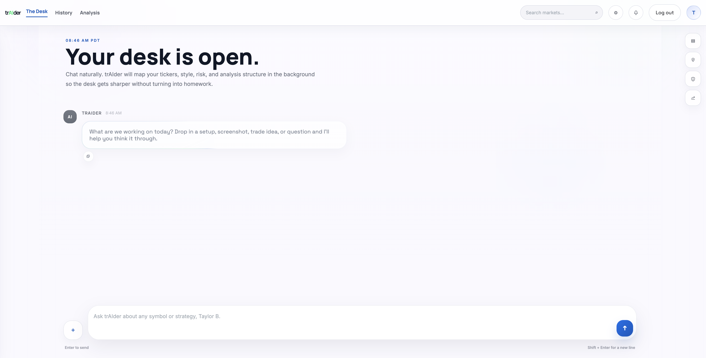
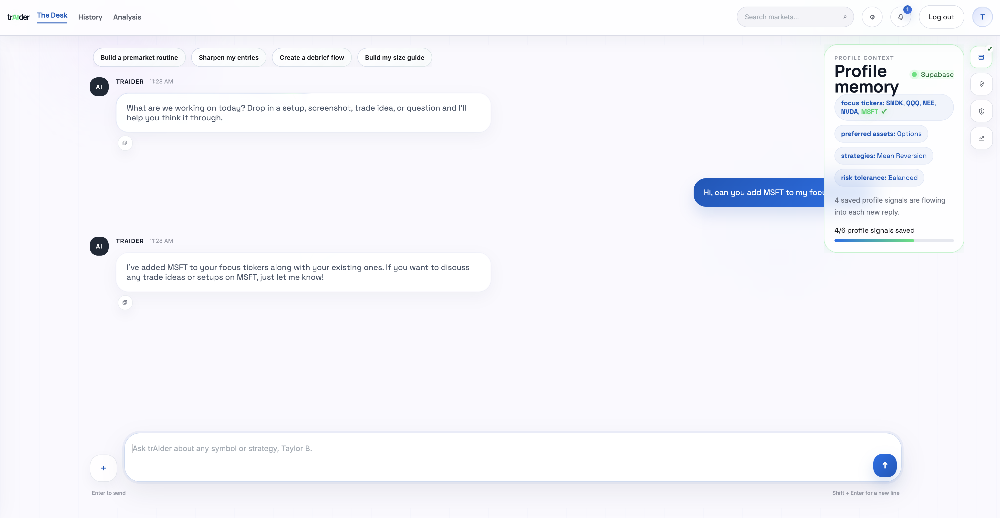

# trAIder

trAIder is a chat-first AI trading workspace. Instead of making traders fill out a bunch of forms, the desk learns through conversation: focus tickers, preferred assets, strategies, risk tolerance, trading goals, recent trades, and coaching context all get mapped in the background while the user talks naturally.

The product is built around a premium desk experience:
- a fast streaming coaching chat
- persistent profile memory saved to Supabase
- a market pulse strip for focus tickers and popular names
- notifications and right-rail memory updates
- history and analysis views
- a P&L calendar that can log trades directly from conversation

## Screenshots

### Login



### Desk entry



### Profile memory



## Stack

- Next.js App Router for the frontend and Vercel deployment target
- Supabase Auth for magic-link sign-in and optional Google OAuth
- Supabase Postgres for profiles, conversations, messages, notifications, and P&L calendar entries
- OpenAI for coaching responses
- Financial Modeling Prep for the market pulse snapshot
- Optional Google Programmable Search for web-grounded coach lookups

## Project structure

- `src/` contains the live Next.js app
- `supabase/migrations/` contains the schema used by the workspace
- `legacy_fastapi/` contains the earlier FastAPI prototype kept only as reference

## Clone and run locally

### 1. Clone the repo

```bash
git clone https://github.com/tb1121/trAIder.git
cd trAIder
```

### 2. Install dependencies

```bash
npm install
```

### 3. Create local environment variables

Copy `.env.example` to `.env.local` and fill in the values for your own setup.

```bash
cp .env.example .env.local
```

Minimum required values:

```bash
NEXT_PUBLIC_SUPABASE_URL=your_supabase_project_url
NEXT_PUBLIC_SUPABASE_ANON_KEY=your_supabase_anon_key
NEXT_PUBLIC_APP_URL=http://localhost:3000
OPENAI_API_KEY=your_openai_key
```

Optional values:

```bash
OPENAI_MODEL=gpt-5.4-mini
FMP_API_KEY=your_fmp_key_here
GOOGLE_SEARCH_API_KEY=your_google_search_key_here
GOOGLE_SEARCH_CX=your_programmable_search_engine_id_here
```

Notes:
- `FMP_API_KEY` powers the market pulse strip. Without it, that section will fall back gracefully.
- `GOOGLE_SEARCH_API_KEY` and `GOOGLE_SEARCH_CX` are only needed if you want the coach to do grounded web lookups.
- `NEXT_PUBLIC_APP_URL` should be `http://localhost:3000` for local development.

### 4. Apply the Supabase schema

Run the SQL migrations in `supabase/migrations/` in timestamp order against your Supabase project:

1. `202603260001_traider.sql`
2. `202603270001_conversation_titles.sql`
3. `202603280001_profile_notifications.sql`
4. `202603300001_message_attachment_previews.sql`
5. `202603310001_trade_calendar.sql`

If you prefer, you can paste them into the Supabase SQL editor one by one in that order.

### 5. Configure authentication

The app currently supports:
- email magic links
- Google sign-in if you enable the Google provider in Supabase

If you want Google auth locally, also configure:
- Supabase `Authentication -> Sign In / Providers -> Google`
- a Google OAuth client with the Supabase callback URL

If you do not configure Google, the app still works with magic-link login.

### 6. Start the app

```bash
npm run dev
```

Then open:

```text
http://localhost:3000
```

## What a local tester should expect

After logging in, a user should be able to:
- start a fresh desk chat
- let the coach learn profile context naturally through conversation
- see memory updates in the right rail
- log trades into the P&L calendar through chat
- review saved coaching threads in History
- inspect profile depth and trade logging in Analysis

## Deploy to Vercel

1. Push the repo to GitHub
2. Import it into Vercel
3. Add the same environment variables from `.env.local`
4. Redeploy

For production, make sure your Supabase auth URLs and OAuth redirects are configured for the deployed domain.

## Scripts

```bash
npm run dev
npm run build
npm run start
npm run lint
npm run typecheck
```

## Notes

- The workspace is optimized for a polished chat-first experience, so a lot of product behavior lives in `src/components/chat-workspace.tsx` and `src/lib/coach.ts`.
- The legacy FastAPI app is not the main runtime anymore and should be treated as an archive/reference path.
